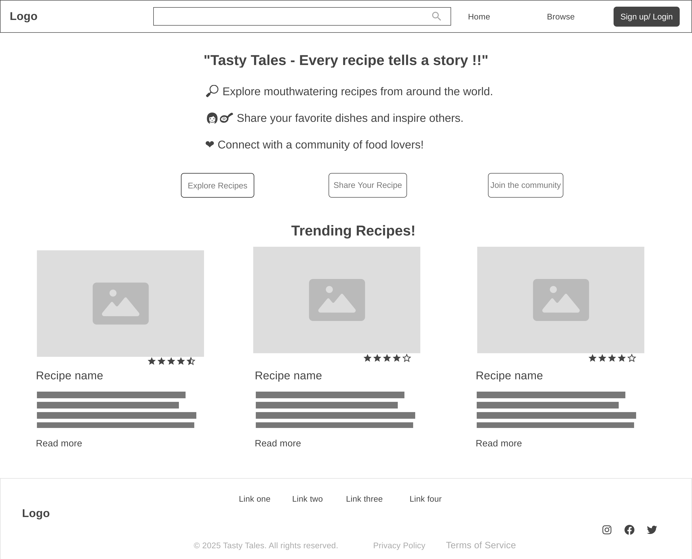
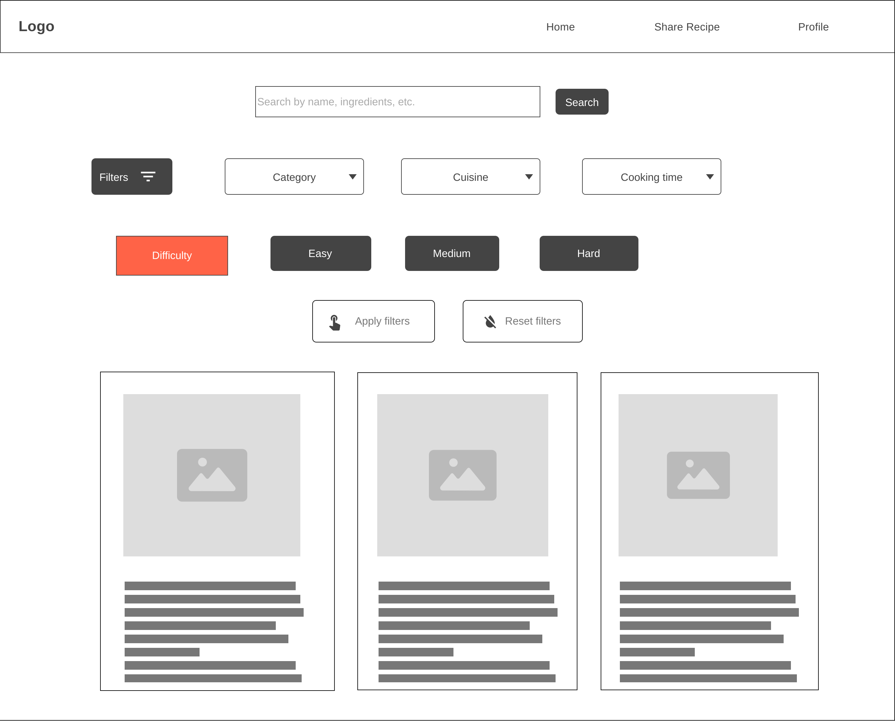

# ***TASTY TALES***

## **Every recipe tells a story !!**

### **Objective:**

Tasty tales is a recipe sharing platform where users can share, explore, and review recipes. It creates a community-driven space where food enthusiasts can,

- Upload their recipes.
- Provide step-by-step cooking instructions.
- Interact with others through comments and ratings.
- Bookmark their favourite recipes.

### **Features:**

1. 👩🏻‍🍳 **User Features:**

   - **User Authentication** - Signup/Login with email and password.
   - **Create & Manage Recipes** - Add, edit, delete your own recipes.
   - **Image Upload** - Upload pictures of dishes for better presentation.
   - **Search & Filter** - Find recipes based on name, ingredients, or category.
   - **Ratings & Reviews** - Rate dishes and leave comments.
   - **Bookmark Recipes** - Save your favorite recipes for later.

1. 🛠️ **Admin Features:**

   - **Manage Users** - Restrict or ban users if necessary.
   - **Recipe Moderation** - Remove inappropriate recipes.
   - **Comment Moderation** - Delete offensive or spam comments.

### **Project Workflow:**

1. **Home Page**
     - Displays trrending recipes.
     - Search bar to find recipes by name, category, or ingredient.

     

1. **Signup & Login Page**
     - User authentication with email and password.
     - Redirects to user dashboard after successful login.

       

       

1. **User Dashboard**
     - Displays user's uploaded recipes.
     - Lists bookmarked recipes.
     - Option to add new recipe.
1. **Recipe Details Page**
     - Displys recipe name, ingredients, steps and cooking time along with the pictures uploaded by the users if any.
     - Users can comment and rate the recipe.
     - "Save to Favourites" option for the users.

     
1. **Admin Dashboard**
     - View, edit or delete any recipe.
     - Remove inappropriate comments.

### **Tech Stack:**

- **Frontend** - Reactjs
- **Backend** - Nodejs + Expressjs
- **Database** - MongoDB
